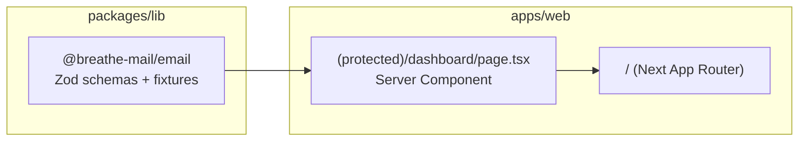
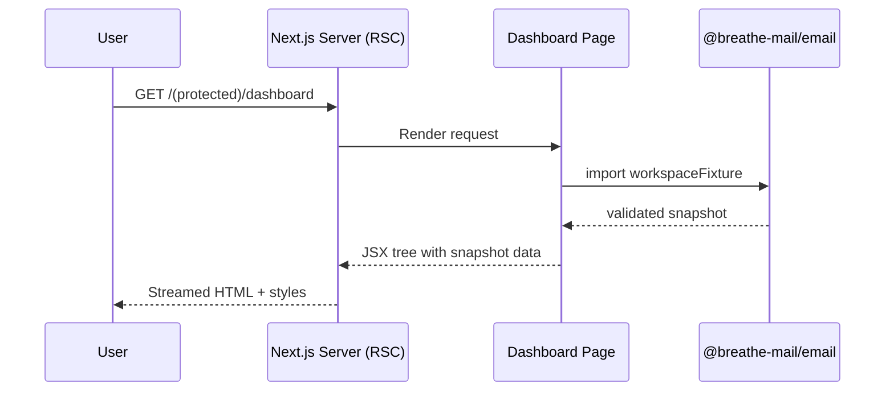

# Breathe Mail Architecture

## System Overview
- pnpm monorepo: `apps/web` (Next.js App Router) + `packages/lib/email` (shared domain contracts)
- Server-first UX: dashboard page renders as async RSC, pulls typed fixtures from shared lib for predictable data
- Tooling guardrails: TypeScript, Tailwind, shadcn/ui, Vitest, ast-grep, knip, jscpd wired via pnpm scripts and Husky hooks

## Runtime Composition
- **Dashboard page** (`apps/web/app/(protected)/dashboard/page.tsx`) is a server component that formats snapshot data into Tailwind UI sections
- **Shared contracts** (`packages/lib/email/src/schemas.ts`) define Zod schemas for commands, insights, calendar, follow-ups, snoozed items, awaiting replies; fixtures validated at import time ensure pages never render invalid data
- **Tests** (`packages/lib/email/src/schemas.test.ts`) exercise schema acceptance/rejection to guard against contract drift
- **Styling** handled through Tailwind config (`apps/web/tailwind.config.ts`) with brand palette tokens

## Data & Validation
- `workspaceSnapshotSchema` models full command center payload; individual slices (commands, insights, etc.) are re-usable for future APIs or server actions
- Fixtures parsed through schema at module scope to fail fast during build/test if contracts change
- Client imports limited to schema-driven data; no server-only modules leak into the UI bundle

## Testing & Tooling
- `pnpm -F web test` runs Vitest suites (currently schema tests) under jsdom
- Static analysis via `pnpm -F web scan` (ast-grep), `dead` (knip), `dupes` (jscpd); aggregated under `refactor:check`
- Husky hooks keep lint/scan gates enforced before commits/pushes

## Growth Guardrails
- Add service/database logic under `apps/web/server` or new workspace libs to preserve client/server boundaries
- Expand dashboard data by extending Zod schemas first, then fixtures/tests, finally server components
- Future API endpoints should live under `apps/web/app/api/v1` with matching Zod validators and MSW mocks
